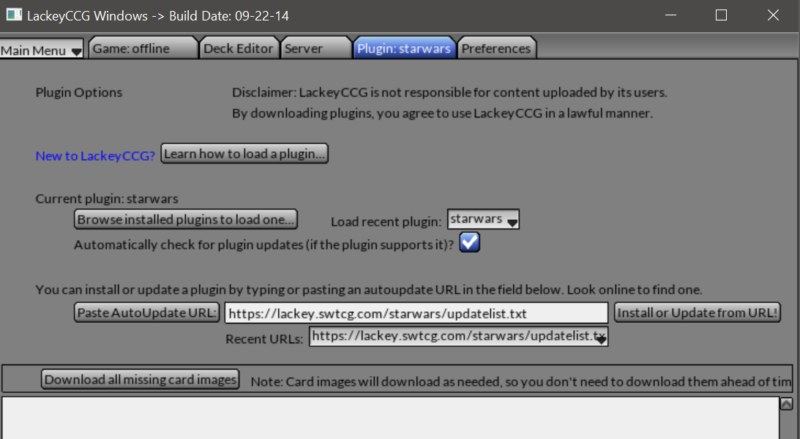

# STAR WARS TRADING CARD GAME #
## THE LACKEYCCG PLUGIN ##

---

     

  

## INSTALLATION METHODS ##

There are two ways to install this plugin. You can either use the autoupdate url, or else you can manually download the latest release and place it in the plugins folder of your LackeyCCG installation.

---

### METHOD 1: AUTOUPDATE URL ###

The preferred method of installing the swtcg plugin is to use the autoupdate url. <https://lackey.swtcg.com/starwars/updatelist.txt>

All you have to do is open LackeyCCG, navigate to the plugins tab, paste the above url into the text box between the "Paste AutoUpdate URL:" and "Install or Update from URL!" buttons and then finally, click the "Install or Update from URL!" button.

